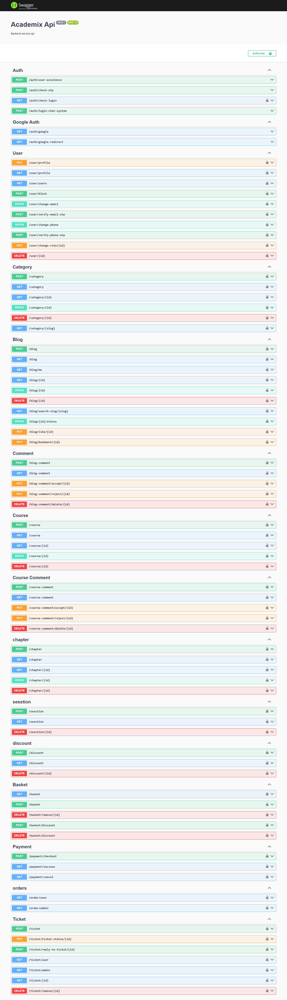

# Academix 

### **About**

Academix API is a backend service designed for managing educational platforms. Built with NestJS, this API provides a robust and scalable solution for handling users, courses, blogs, orders, and payment systems. It follows a modular architecture, ensuring flexibility and easy expansion based on educational needs.

---

## 🚀 Key Features  

### 🔒 Authentication & Authorization  
- **JWT-based Authentication**: Secure login with JSON Web Tokens.  
- **Google OAuth Integration**: Sign in easily with your Google account.  

### 👤 User Management  
- Register, login, update profiles, and manage email/password changes.  
- **Role-based Access Control**: Different permissions for students, instructors, and admins.  

### 📚 Course & Content Management  
- Create and manage interactive courses.  
- Organize lessons and chapters with ease.  
- Assign categories to keep content structured.  

### ✍️ Blog System  
- Full **CRUD** operations for blog posts.  
- User comments with admin moderation for quality control.  

### 🛒 E-commerce & Payment  
- Shopping cart and order management for course purchases.  
- **Coupon & Discount System**: Flexible pricing strategies.  
- Secure payment processing (integrate with payment gateways, e.g., Stripe or PayPal, via NestJS services).

### 🧰 Support & Ticketing System  
- Users can create support tickets.  
- Admins can manage and respond efficiently.  

### 💬 Real-time Chat System  
- Live messaging between users and instructors.  
- **WebSocket-based**: Fast, real-time communication.  

---

## 🛠️ Technologies  
Academix is built using modern, industry-standard technologies to ensure performance, scalability, and maintainability:  
- **Framework**: NestJS (Node.js framework for building efficient, reliable server-side applications).  
- **Language**: TypeScript (for type safety and better code maintainability).  
- **Real-time Communication**: Socket.IO (for real-time chat and notifications).  
- **Database**: MySQL (managed via TypeORM for ORM and query optimization).  
- **Authentication**: JSON Web Token (JWT) and Passport.js (for secure and flexible authentication strategies).  
- **API Documentation**: Swagger (OpenAPI) for interactive and clear API documentation.  
- **Cloud Hosting**: AWS (for deployment, scaling, and high availability—e.g., EC2, RDS for MySQL, S3 for file storage, if applicable).  
- **ORM**: TypeORM (for database modeling and migrations).  
- **Dependencies**: Managed via `package.json` (install with `npm install`).

---

## 📋 Prerequisites  
Before setting up Academix, ensure you have the following installed:  
- **Node.js 16+** or higher.  
- **npm** (Node Package Manager, usually comes with Node.js).  
- **MySQL Server** (for the database—ensure it’s running locally or on AWS RDS).  
- **AWS CLI** (for AWS deployment and configuration, if applicable).  
- **Git** for cloning the repository.  
- Dependencies listed in `package.json` (install with `npm install`)

---

# Preview Academix



---

## 🏃 Installation  

Follow these steps to set up Academix locally:  

### 1. Clone the Repository  
```bash
git clone https://github.com/Hossein-Falah/academix.git
cd academix  
```

### 2. Install Dependencies  
```bash
npm install  
```

### 3. Set Up Environment Variables  
Create a `.env` file in the root directory and add your configuration:
```env
# Server Configuration
PORT=3000
BASE_URL=http://localhost:3000

# Database Configuration
DB_PORT=3306
DB_NAME=academix
DB_USERNAME=your_db_username
DB_PASSWORD=your_db_password
DB_HOST=your_db_host

# Authentication Secrets
ACCESS_TOKEN_SECRET=your_access_token_secret
OTP_TOKEN_SECRET=your_otp_token_secret
EMAIL_TOKEN_SECRET=your_email_token_secret
PHONE_TOKEN_SECRET=your_phone_token_secret
COOKIE_SECRET=your_cookie_secret

# Google OAuth
GOOGLE_CLIENT_ID=your_google_client_id
GOOGLE_CLIENT_SECRET=your_google_client_secret
GOOGLE_CALLBACK_URL=http://localhost:3000/auth/google.redirect

# AWS S3 or Object Storage
S3_BUCKET_NAME=your_s3_bucket_name
S3_ACCESS_KEY=your_s3_access_key
S3_SECRET_KEY=your_s3_secret_key
S3_ENDPOINT=your_s3_endpoint

# Stripe Payment Gateway
STRIPE_PUBLISHABLE_KEY=your_stripe_publishable_key
STRIPE_SECRET_KEY=your_stripe_secret_key

# Redis Configuration
REDIS_HOST=localhost
REDIS_PORT=6379
REDIS_PASSWORD=your_redis_password

# JWT Secret
JWT_SECRET_KEY=your_jwt_secret_key

```
(Customize based on your MySQL, AWS, and authentication configurations.)

### 4. Configure MySQL Database  
Create a MySQL database named `academix_db` (or as specified in `.env`).
Run TypeORM migrations to set up the schema:
```bash
npx typeorm migration:run  
```

### 5. Run the Application  
Start the NestJS server in development mode:
```bash
npm run start:dev  
```

### 6. Access the API  
View the Swagger documentation at [http://localhost:3000/swagger](http://localhost:3000/swagger) (or your configured port) to explore and test endpoints.

## 📖 Usage  
Academix provides a rich API for interacting with its features. Here’s how to get started:

### Example: Authenticating a User  
- Send a POST request to `/auth/user-existence` to check if a user exists.
- Log in with `/auth/check-login` using JWT or Passport strategies (e.g., Google OAuth).
- Use the token to access protected routes like `/user/profile`.

### Example: Creating a Course  
- Authenticate as an instructor.
- Send a POST request to `/course` with course details (e.g., title, description, category).
- Manage real-time interactions (e.g., chat) via Socket.IO endpoints.

Refer to the Swagger UI for all available endpoints, request/response schemas, and example payloads.

## 📝 API Documentation  
Academix’s API is fully documented using Swagger (OpenAPI). Access the interactive documentation at:
- **Local:** [http://localhost:3000/swagger](http://localhost:3000/swagger) (after running the app).
- **Online:** (If deployed on AWS, provide the public URL here.)

The Swagger UI includes:
- All endpoints (e.g., Auth, User, Course, Blog, Payment, etc.).
- HTTP methods (GET, POST, PUT, DELETE).
- Request/response schemas for each endpoint, including authentication (JWT/Passport) and real-time features (Socket.IO).

## 🤝 Contributing  
We welcome contributions to enhance Academix! Here’s how you can help:
1. Fork the repository.
2. Create a new branch: `git checkout -b feature/your-feature`.
3. Make your changes and commit: `git commit -m "Add feature: Your description"`.
4. Push to your branch: `git push origin feature/your-feature`.
5. Open a Pull Request with a detailed description of your changes.

Please follow our `CONTRIBUTING.md` (create this file if needed) for guidelines.

## 🌍 Deployment on AWS  
To deploy Academix on AWS:
- **Database:** Use AWS RDS for MySQL to host your database, ensuring scalability and backups.
- **Backend:** Deploy the NestJS app on AWS EC2, Elastic Beanstalk, or Lambda.
- **Real-time Communication:** Configure Socket.IO with AWS services (e.g., Elastic Load Balancer or API Gateway for WebSocket support).
- **File Storage:** Use AWS S3 for storing course materials, blog images, and other uploads (if Multer is integrated).
- **API Gateway:** Optionally, use AWS API Gateway for routing and scaling API requests.
- **Load Balancing & Scaling:** Configure AWS ELB and Auto Scaling for high availability.
- **Environment Variables:** Securely manage `.env` variables using AWS Secrets Manager or Parameter Store.

Ensure proper CI/CD pipelines (e.g., using AWS CodePipeline or GitHub Actions) for automated deployments.

## 📜 License  
This project is licensed under the MIT License. See the `LICENSE` file for details.

## 📧 Contact  
Have questions or suggestions? Get in touch:
- **Email:** hosseinfalah2021@gmail.com
- **Email:** hosseinfalah.work@gmail.com
- **X:** [@HosseinFalah10](https://x.com/HosseinFalah10)
- **GitHub Issues:** Open an issue in this repository for bugs or feature requests.

## ❤️ Acknowledgments  
- Thanks to the NestJS, TypeScript, Socket.IO, and AWS communities for their incredible tools.
- Special appreciation for Swagger, TypeORM, Passport, and JWT for enabling secure and efficient development.

⭐ **Star this repo if you find Academix useful!** ⭐
